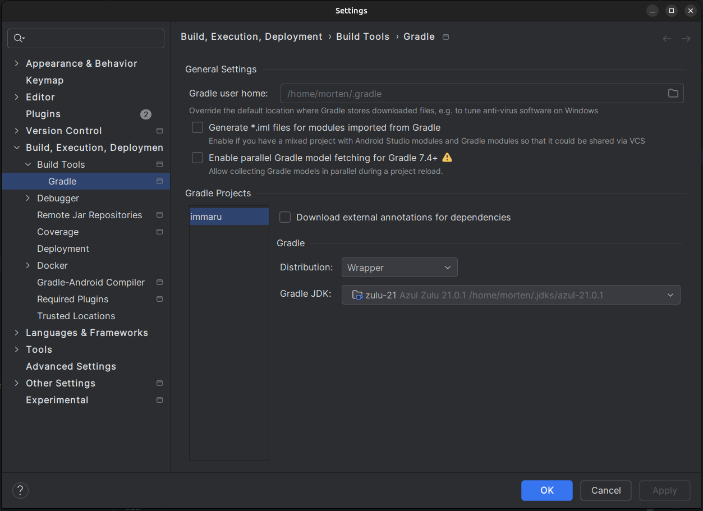

# Immaru Media Library

## Project setup

Immaru is a Kotlin multiplatform project which consists of the following main parts:

* shared
* frontend
* backend

The shared code is a Kotlin multiplatform project which contains common code which is shared between the frontend and backend. It mostly contains the domain functionality.

The frontend consists of a Kotlin Compose application which targets multiple platforms and provides the user interfacing application which 'talks' to the backend.

The backend is a jvm application which uses the shared code and exposes a rest api to add/modify/remove entries of the domain model.
It uses both a Postgresql database for storing the model, as direct file storage to persist the actual assets (like images and video files).

The main targets are Android, JVM and iOS. Preferably the project also wants to support Wasm in the browser, but this target does not support some of the required functionalities currently used in the common code.

## Running the project locally

1. Start the backend 
   1. Copy the example configuration file /config/example.immaru.properties to /config/immaru.properties
   2. Start Postgres using the provided docker-compose.yml file in the project root

       $ docker compose up

   3. Start the backed application /backend/server/src/main/kotlin/com.earthrevealed.immaru.ImmaruServer.kt - main

2. Start the frontend
   1. Start the jvm frontend /frontend/composeApp/src/jvmMain/kotlin/main.kt - main
   2. Start the android frontend
      1. Add a new Android device if not already present
      2. Run the android frontend frontend/composeApp/src/androidMain/kotlin/com.earthrevealed.com/MainActivity
      3. Configure the server url: `http://10.0.2.2:8080`
   3. Start the iOS frontend
    Currently this is not tested yet because development does not have a Apple device for building/testing this.

## IntelliJ configuration

While running a build from within IntelliJ/Android Studio it is possible a linkage error occurs.
The build.gradle.kts file specifies that the jvm version to use for the jvm target is JVM 21.
However, if IntelliJ/Android Studio is configured to use a lower version jdk for running gradle tasks,
the different files might be compiled using mixed versions resulting in the linkage error.
To solve this issue, configure the proper jdk in the settings:

